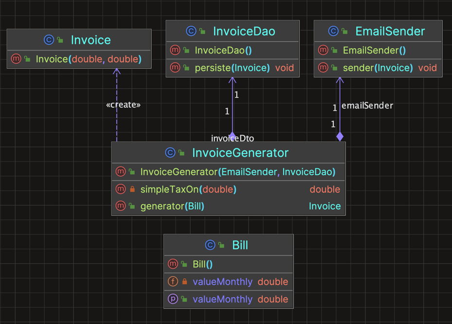
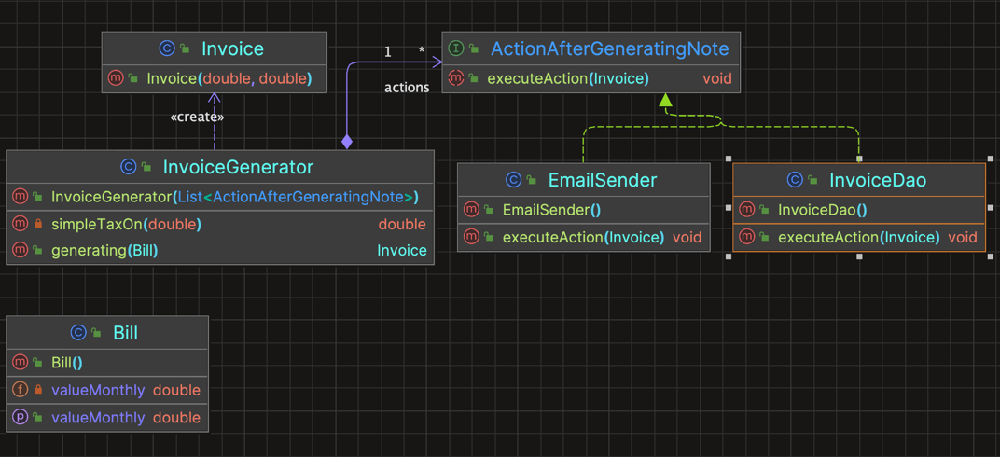

# Dependency Inversion Principle

"A máxima da orientação a objetos, que é: **tenha classes que são muito coesas e pouco acopladas**."

## Problemática do acoplamento:

Vá até: `src/D/bad/exe01/InvoiceGenerator.java` e leia bem o código.

#### QUAL O PROBLEMA DELA?
A classe `InvoiceGenerator` atualmente possui um **acoplamento** significativo com as classes `EmailSender` e `InvoiceDao`. 
Em sua funcionalidade atual, ela é responsável por enviar e-mails e salvar dados no banco de dados por meio do DAO.

No entanto, é importante considerar que futuramente esse código poderá ser expandido para executar outras tarefas, 
como integrar com o sistema SAP, enviar mensagens SMS, interagir com diversos outros sistemas da empresa e desempenhar 
uma variedade de funções adicionais. Consequentemente, a classe `InvoiceGenerator` provavelmente crescerá e se tornará 
dependente de um número crescente de classes e funcionalidades.

Problemas relevantes:
- Uma mudança em qualquer uma das classes pode impactar em mudanças na classe principal.
- A partir do momento em que uma classe possui muitas dependencias, todas elas podem propagar problemas para a classe principa.
- O reuso da classe fica cada vez mais difícil, afinal, se quisermos reutilizar uma determinada classe em outro lugar,
precisaremos levar junto todas as suas dependências.

Diagrama:

#### COMO RESOLVER?
É impossivel eliminar completamente o acoplamento em sistemas de médio/grande porte. 
Em vez disso, devemos diferenciar os tipos de acoplamento. Alguns acoplamentos são mais problemáticos do que outros,
e é impostante identificar e evitar os "acoplamentos perigosos" ao projetar sistemas, o que é essencial no contexto dos 
princípios SOLID de Design de software. 

#### Estabilidade de classes:
Geralmente, interfaces como List e Classes como String são acopladas a nossa classe principal, mas o porque não se preocupamos? 
A resposta, na verdade, é a interface List é `ESTÁVEL`. Ela muda muito pouco, ou quase nunca. E como ela quase nunca muda, 
ela raramente propaga mudanças para a classe principal. Esse é o tipo de "acoplamento bom": a de `dependência estável`.

#### Buscando por classes estáveis:
Para criar módulos estáveis, como a Oracle fez com List? As interfaces são um caminho eficaz. 
Interfaces representam contratos, não contêm código que possa forçar mudanças e geralmente têm implementações. 
Isso incentiva os desenvolvedores a considerar cuidadosamente antes de alterar o contrato, contribuindo para a estabilidade do código.

*"Programe voltado para interfaces"* 

Abaixo, o primeiro exemplo repassado mais acima, mas agora usando interface e não mais dependendo das classes de enviar e-mail 
e persistir no banco de dados.
Vá até: `src/D/good/exe01/InvoiceGenerator.java` e leia bem o código.

É importante observar que a classe principal não terá mais dependência direta das classes InvoiceDao e EmailSender,
e mesmo se forem adicionadas mais ações representadas por classes instáveis, a classe principal continuará independente delas. 
Isso ilustra a aplicação do Princípio da Inversão de Dependência (DIP) no design, onde a classe principal não depende de detalhes de implementação, mas sim de abstrações, promovendo a flexibilidade e reduzindo o acoplamento. Veja o diagrama abaix:

#### DIP:
Agora que sabemos o que é estabilidade, vamos falar sobre o principio de inversão de dependências. 
A idea é: Sempre que uma classe for depender de outra, ela deve depender sempre de outro módulo mais estável do que ela mesma.
Lembre-se: 
- Abstrações tendem a ser estáveis, e implementações instáveis.
- Abstrações não devem depender de implementações.

# WIP - Ainda irei adicionar o exemplo 02 e mais teorias. 

