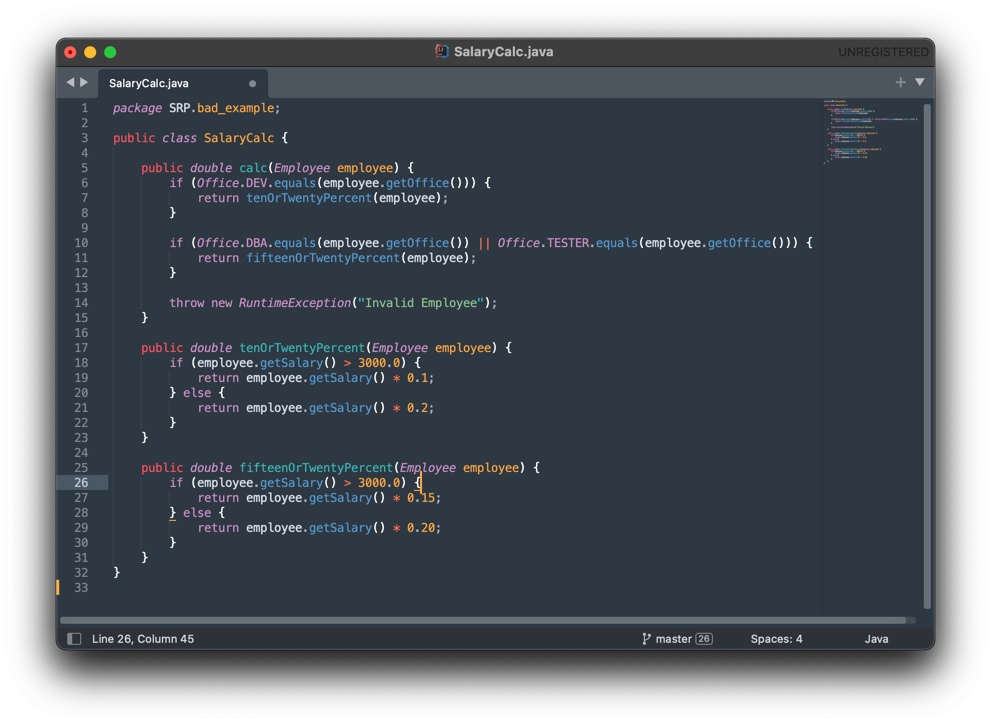
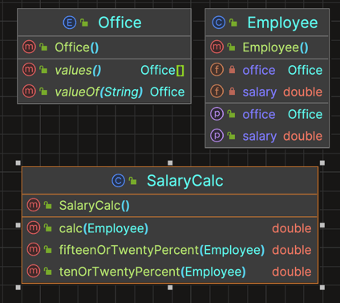
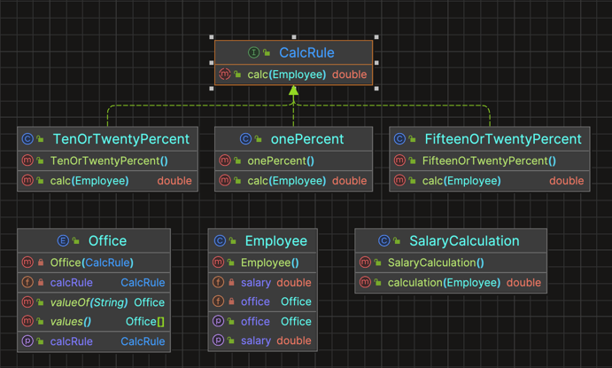

# Single Responsibility Principle

“Uma classe deve ter apenas um motivo para mudar, deve ter apenas uma única responsabilidade.”

**God Class** : Na programação orientada a objetos, é uma classe que sabe demais ou faz demais.

## CLASSES COESAS:
Uma classe coesa é aquela que possui uma única responsabilidade.

### Vamos ver um exemplo de uma classe não coesa:

Suponha uma classe SalaryCalc. Ela, como o prórprio nome já diz, é responsável por calcular salários do funcionário.
A regra: De acordo com o cargo e o salário dele, o desconto aplicado é diferente. 

Repare que cada uma das regras é implementada por um método privado, como o tenOrTwentyPercent().

#### QUAL O PROBLEMA DELA?

Tente generalizar esse exemplo de código.

Repare que existem apenas 2 cargos diferentes(DBA e DEV) com regras similares.

Agora imagine adicionando mais 10 cargos! Ou seja, essa clase tem tudo para ser uma classe GIGANTESCA.

Agora imagine que exista a necessidade de se reutilizar o método tenOrTwentyPercent() em algum outro ponto do sistema.
Levar a classe inteira para outro sistema, ou mesmo fazer outra classe depender dela só pra reutilizar esse comportamento,
é um pecado.

**Essa classe não é nada coesa e facilmente ganha o SELO:**

#### COMO RESOLVER?

Vamos primeiro entender por que a classe não é coesa:

- Toda classe que não é coesa não para de crescer nunca.
- Motivos para que a classe em questão não pare de crescer:
  - Sempre que um cargo novo surgir (`primeiro problema`);
  - Sempre que uma nova regra de calculo surgir(`segundo problema`).

##### Resolvendo o segundo problema:

Observe cada método privado: tenOrTwentyPercent e fifteenOrTwentyPercent. Apesar de terem implementações diferentes, 
elas posuem o mesmo "esqueleto"(forma, abstração). A ideia é colocar cada uma dessas regras em classes diferentes, todas
implementando a mesma interface.

Dessa forma será bem dificil que uma mudança em uma das regras afete a outra regra.
Cada classe irá conter apenas uma regra, fazendo essa classe muito coesa, afinal ela só irá mudar se aquela regra em particular mudar.

##### Resolvendo o primeiro problema(Bônus):

ENCAPSULAMENTO!

Nessa implementação, DEV e DBA são *enums*. Sempre que surgir um novo cargo, é obrigado adicionar um novo item nesse enum
e alterar a classe `SalaryCalc`. 

Precisamos deixar essa decisão de design mais clara. O desenvolvedor deve saber rapidamente que, ao criar um novo cargo,
uma regra de calculo deve ser associada a ele. Precisamos `encapsular` melhor todo esse problema, para que a mudança, quando 
feita em um único ponto, seja propagada naturalmente. 

